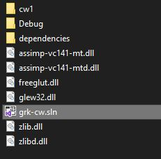

# Pierwsze uruchomienie

Kolejne zadania będą dostarczane jako projekty w visual studio, które powinny być otwierane w ramach jednego solution. Żeby uruchomić zadania należy pobrać i rozpakować solution znajdujące się pod adresem TODO. Zawiera ono wszelkie potrzebne zależności. Następnie należy pobrać projekt określonego zadania (w tym wypadku zadania 1 znajdujące się TODO) i wkleić zawartość do folderu z Solution.

Struktura powinna wyglądać nastęująco:

Otwórz plik `grk-cw.sln` w visual studio, ustaw projekt z ćwiczeniami jaki projekt startowy.  Poszczególne zadania są dostarczane jako osobne pliki z rozszerzeniem hpp, żeby uruchomić zadanie zmień ostatni include.

# Opis projektu

W zadaniach korzystamy z kilku bibliotek, mianowicie:
* **GLEW** OpenGL Extension Wrangler Library - biblioteka odpowiedzialna za ładowanie opengla, umożliwia zdeterminowanie jakie wersje opengla są obsługiwane na maszynie i jakie rozszerzenia są dostęne.
* **GLFW** Graphics Library Framework - biblioteka umożliwiająca tworzenie okien i obsługę wejścia użytkownika. Pozwala na stworzenie więcej niż jednego okna i posiada obsługę nie tylko klawiatury i myszy, ale również padów i joysticków.
* **GLM** OpenGL Mathematics - biblioteka matematyczna.


## Omówienie pliku main.cpp

Zaczniemy od funkcji main. 

```C++
#include "glew.h"
#include <GLFW/glfw3.h>
#include "glm.hpp"

#include "Shader_Loader.h"
#include "Render_Utils.h"
#include "ex_1_1.hpp"


int main(int argc, char ** argv)
{
    // inicjalizacja glfw
    glfwInit();
    glfwWindowHint(GLFW_CONTEXT_VERSION_MAJOR, 3);
    glfwWindowHint(GLFW_CONTEXT_VERSION_MINOR, 3);
    glfwWindowHint(GLFW_OPENGL_PROFILE, GLFW_OPENGL_CORE_PROFILE);

#ifdef __APPLE__
    glfwWindowHint(GLFW_OPENGL_FORWARD_COMPAT, GL_TRUE);
#endif

    // tworzenie okna za pomocą glfw
    GLFWwindow* window = glfwCreateWindow(500, 500, "FirstWindow", NULL, NULL);
    if (window == NULL)
    {
        std::cout << "Failed to create GLFW window" << std::endl;
        glfwTerminate();
        return -1;
    }
    glfwMakeContextCurrent(window);

    // ladowanie OpenGL za pomoca glew
    glewInit();
    glViewport(0, 0, 500, 500);
    
    init(window);

    // uruchomienie glownej petli
    renderLoop(window);

    shutdown(window);
    glfwTerminate();
    return 0;
}

```

W pierwszych trzech instrukcjach inicjalizujemy glfw za pomocą `glfwInit()`. Za pomocą `glfwWindowHint` ustawiamy wersję opengla na 3.3. Ta funkcja pozwala na ustawienie różnych opcji pełną listę można zobaczy [tu](https://www.glfw.org/docs/3.3/window_guide.html#window_hints). Należy je wykonać przed utworzeniem okna. 

Okno tworzymy funkcją `glfwCreateWindow`, jako argumenty przekazujemy rozmiar okna i jego tytuł. Czwarty argument służy do ustawienia, na którym monitorze ma się okno pokazać, jeżeli będzie uruchomione w pełnym ekranie. Natomiast ostatni do przekazania kontekstu okna, jeżeli ma je współdzielić z innym. Nie będziemy korzystać z tych opcji, więc ustawiamy je na null. Funkcja zwraca wskaźnik na okno, który będzie nam potrzebny, żeby cokolwiek z nim zrobić. Ustawiamy okno na `current` za pomocą funkcji  `glfwMakeContextCurrent`. W ten sposób przypisujemy okno do danego wątku. 

`glewInit` inicjalizuje opengla a `glViewport` przekazuje jaki jest rozmiar okna do opengla.

Następne 3 funkcje `init`, `renderLoop` i `shutdown` są naszymi funkcjami, które znajdują się w plikach z zadaniami (nazwa plik `ex_X_Y.hpp` to **X** to numer ćwiczeń a **Y** to numer zadania). 

# Omówienie ex_1_1.hpp 

Funkcje `init` i `shutdown` będziemy umieszczać instrukcje, które mają być wykonane raz przy odpowiednio uruchomieniu i wyłączeniu aplikacji.

W funkcji `init` znajduje się jedna instrukcja, która ustawia, że `framebuffer_size_callback` zostanie wywołana przy zmianie rozmiaru okna. Ta z kolei informuje opengla o zmianie rozmiaru ekranu za pomocą `glViewport` 

Natomiast `renderLoop` jest funkcją, która ma zawierać główną pętlę i wygląda następująco 
```C++
void renderLoop(GLFWwindow* window) {
    while (!glfwWindowShouldClose(window))
    {
        processInput(window);

        renderScene(window);
        glfwPollEvents();
    }
}
```
pobiera ona okno i wykonuje na nim instrukcje w pętli, dopóki nie dostanie informacji, że ma być ono zamknięte. W tej chwili w pętli znajdują się dwie instrukcje odpowiedzialne za przetworzenie wejścia (czyli obsługę klawiatury i myszy) oraz odświeżenie sceny oraz `glfwPollEvents()`, która sprawdza czy są jakieś zadania do wykonania (na przykład sprawdza, czy rozmiar okna został zmieniony).

```C++
void processInput(GLFWwindow* window)
{
    if (glfwGetKey(window, GLFW_KEY_ESCAPE) == GLFW_PRESS)
        glfwSetWindowShouldClose(window, true);
}
```
W `processInput` sprawdzamy tylko czy wciśnięto Esc, jeżeli tak, to ustawiamy, że aplikacja powinna być zamknięta

```C++
void renderScene(GLFWwindow* window)
{

    // ZADANIE: Przesledz kod i komentarze
    // ZADANIE: Zmien kolor tla sceny, przyjmujac zmiennoprzecinkowy standard RGBA
    glClearColor(0.0f, 0.3f, 0.3f, 1.0f);
    glClear(GL_COLOR_BUFFER_BIT | GL_DEPTH_BUFFER_BIT);

    // Powinno byc wywolane po kazdej klatce
    glfwSwapBuffers(window);
}
```

Natomiast w render scene ustawiamy kolor za pomocą funkcji `glClearColor` i  czyścimy bufory za pomocą `glClear`, *openGL* korzysta z informacji, która przekazaliśmy w `glClearColor`, żeby określić jakiego koloru ma być tło. 
By uniknąć migotania glfw wykorzystuje **double buffering** to znaczy przechowuje dwa bufory, jeden jest wyświetlany a na drugim dokonuje się operacji (określa się je *front* i *back*). Po zakończeniu rysowania zamienia się je miejscami (*swap*). Robimy to za pomocą funkcji  `glfwSwapBuffers`.

### Zadanie
Zmień kolor tła na dowolny inny.

### Zadanie* 
Zmodyfikuj funkcję render scene tak, żeby kolor się zmieniał co klatkę. Możesz do tego skorzystać ze zmiennej globalnej lub czas działania, który możesz uzyskać funkcją `glfwGetTime()`. 

# Zadanie 1_2
Celem tego zadania będzie narysowanie trójkąta, zanim do tego przejdziemy zamień linię `#include "ex_1_1.hpp"` na `#include "ex_1_2.hpp"`.  Przejdź do pliku `ex_1_2.hpp`

Opengl operuje w kostce od \[-1,1\]x\[-1,1\]x\[-1,1\], którą następnie patrzy wzdłóż osi Z. nazywamy tą przestrzeń *clip space* (więcej o tym na wykładzie). Pozostałe osie rozciąga na ekranie. Dodatkowo poza współrzędnymi X, Y, Z potrzebna jest wspórzędna W, która musi być równa 1. Znaczy to, że każdy punkt w trójkącie musi mieć cztery współrzędne, dwie pierwsze z nich zakresu od -1 do 1, trzecia równa 0 a ostatnie zawsze równa 1.  Kolejność punktów również jest istotna, dzięki niej opengl określa orientację ścian. Domyślnie punkty powinny być zorientowane w kierunku przeciwnym do ruchu wskazówek zegra.

### Zadanie
Wymyśl 3 punkty dla trójkąta i umieść je w płaskiej tablicy 12 floatów wewnątrz funkcji `init`. Stworzoną tablicę należy załadować do pamięci karty graficznej przy inicjalizacji. Wykorzystaj do tego funkcję pomocniczą `Core::initVAO`, jako pierwszy argument podaj tablicę, jako drugi liczbę wierzchołków a jako trzeci liczbę punktów w wierzchołku. Funkcja zwraca zmienną typu `GLuint`, która jest identyfikatorem VAO w pamięci karty, przypisz go do zmiennej globalnej triangleVAO.

>W tym zadaniu w funkcji init dochodzi kopilacja shaderów i połączeinu ich w *shader program*. Jest to program, który posłuży nam do wyświetlenia trójkątów, (więcej o shaderach będzie na późniejszych zajęciach).

W `renderScene` wykorzystaj funkcję `Core::drawVAO` do narysowania trójkąta. 

# Zadanie 1_3
Celem tego zadania będzie narysowanie czworokąta. Możemy to zrobić poprzez narysowanie dwóch trójkątów, ale jest nieefektywne, ponieważ powielimy dwa pounkty podwójnie (teraz nie jest to taka duża różnica, ale przy większej liczbie trójkątów jest bardziej istotne). Zamiast tego skorzystamy z indeksowania, czyli oprócz tablicy wierzchołków prześlemy też tablicę indeksów, które będą określać jakie punkty należy wykorzystać do rysowania wierzchołków. 

### Zadanie 
Tym razem wymyśl 4 punkty i umieść je w analogicznej tablic 16 floatów. Oprócz tego stwórz tablicę typu `unsigned int` i umieść w niej indeksy dla wóch trójkątów, które będą tworzych nasz czworokąt. Przekarz obie tablice do GPU za pomocą funcji `Core::initVAOIndexed`. Następnie w funcji `renderScene` użyj funkcji `Core::drawVAOIndexed` analogicznie jak `Core::drawVAO` w poprzednim zadaniu.

# Zadanie 1_4, 1_5, 1_6
Zadania wymagają zdefiniowania odpowiednich macierzy o tym jakiej powinny być postaci można przeczytać [tu](https://pl.wikipedia.org/wiki/Elementarne_macierze_transformacji).

Uważaj, konstrukor `mat4` czyta tablicę `float` kolumnami, czyli będzie ona transponowana w stosunku do tego co jest na ekranie.