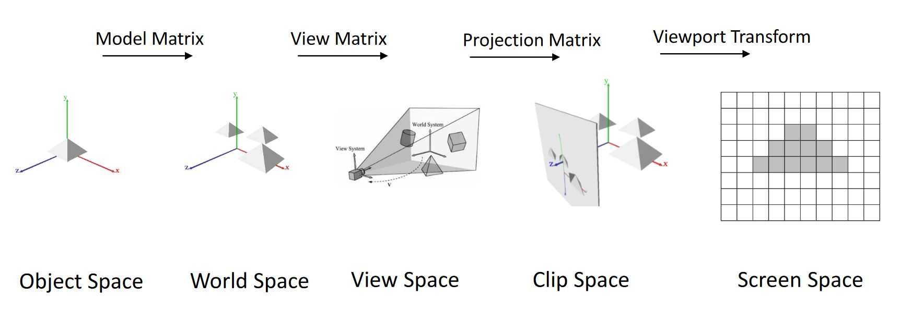
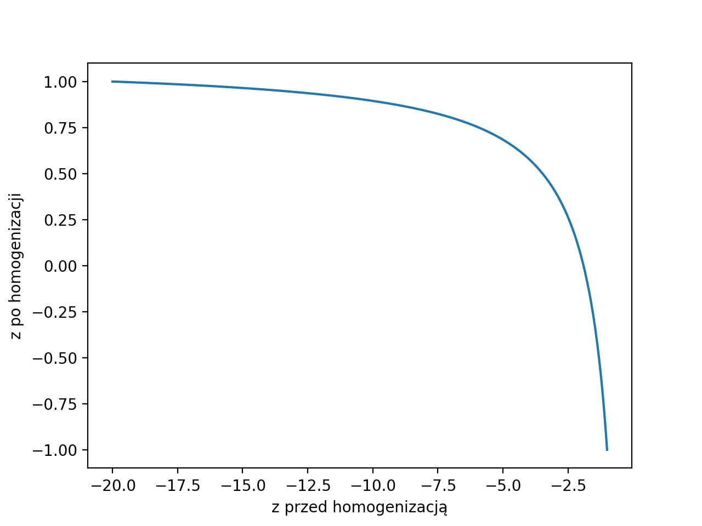
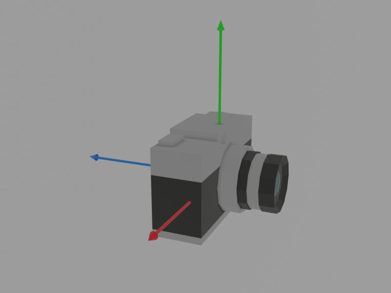

# Ćwiczenia 3
## Przestrzenie potoku graficznego
W trakcie wykładu zostały opisane kolejne przestrzenie potoku graficznego. 
W tej części zajęć przejdziemy kolejne jego etapy. 
 



Pierwszy krok, czyli przejście do `World Space` już wykonujemy za pomocą macierzy transformacji. Następnym krokiem będzie stworzenie macierzy projekcji i macierzy widoku. Zaczniemy od macierzy projekcji. Będziemy modyfikować macierz, którą wysyła funkcja `createPerspectiveMatrix` (macierz jest transponowana dalej, więc zapisuj ją tak, jak tu widzisz). Zanim zaczniemy domnóż macierz perspektywy do macierzy transformacji obiektów.  

**Nim przejdziemy dalej odkomentuj rysowanie prostopadłościanu.** 

## Macierz perspektywy

Rozważmy mnożenie dowolnej macierzy przez wektor kolumnowy:

$$\begin{bmatrix}   m_{11} & m_{12} & m_{13}& m_{14}\\m_{21} & m_{22} & m_{23}& m_{24}\\m_{31} & m_{32} & m_{33}& m_{34}\\m_{41} & m_{42} & m_{43}& m_{44}\\\end{bmatrix}\begin{bmatrix}   x \\ y \\ z \\ w \end{bmatrix}=\begin{bmatrix}   x*m_{11}+y*m_{12}+z*m_{13}+m_{14}\\x*m_{21} +y*m_{22} +z*m_{23} +m_{24}\\x*m_{31} +y*m_{32} +z*m_{33} +m_{34}\\x*m_{41} +y*m_{42} +z*m_{43} +m_{44}\\\end{bmatrix}$$

Pierwszym krokiem jest wykorzystanie homogenizacji do uzyskania efektu perspektywy. W tym celu musimy ustawić współrzędną $w$ na $-z$ za pomocą macierzy. Jeśli przyjrzymy się obliczeniom powyżej. Zobaczymy, że do tego musimy ustawić $m_{43}$ na $-1$ a pozostałe w tym wierszu na $0$. Przemnożenie daje nam:


$$\begin{bmatrix}   1 & 0 & 0& 0\\0 & 1 & 0& 0\\0 & 0 & 1& 0\\0 & 0 & -1& 0  \end{bmatrix}\begin{bmatrix}   x \\ y \\ z \\ 1 \end{bmatrix}=\begin{bmatrix}   x \\ y \\ z \\ -z\end{bmatrix}$$


Po homogenizacji otrzymamy wektor:


$$\begin{bmatrix}   -\frac{x}{z} \\ -\frac{x}{z} \\ -1 \\ 1\end{bmatrix}$$


----

### Zadanie 
zmodyfikuj macierz perspektywy w taki sposób.

----

Wartość współrzędnej $z$ jest równa -1 dla każdego parametru. Co spowoduje, że nie będzie wiadomo, który wierzchołek bliżej, a który dalej i otrzymam zjawisko znane jako z-fighting. By tego uniknąć. Musimy zmapować współrzędną $z$. 
Przypomnijmy, że przy arbitralnej macierzy wartość współrzędnej $z$ będzie następującej postaci:

$$ x*m_{31} +y*m_{32} +z*m_{33} +m_{34} $$

więc możemy pracować tylko z parametrami $m_{33}$ i $m_{34}$, czyli $z*m_{33} +m_{34}$, po uwzględnieniu dodatkowo homogenizacji otrzymamy ostateczny wzór:

$$ z'=-m_{33} -\frac{m_{34}}{z}.$$

Przypomnijmy, że w `Clipping Space` współrzędna $z$ musi się mapować na wartości od $-1$ do $1$, żeby znalazły się w bryle kanonicznej (obiekty poza bryłą kanoniczną nie będą wyświetlone). Jak na wykładzie określimy sobie parametry $0 < n < f$, które będą określać pozycję minimalnej i maksymalnej płaszczyzny osi $z$. Chcemy, żeby dla $z=n$ wartość $z'$ wynosiła $-1$ oraz dla $z=f$ wartość $z'$ wynosiła $1$, daje nam to układ równań:


$$\begin{matrix} -m_{33}& -&\frac{m_{34}}{n}&=&-1\\-m_{33} &-&\frac{m_{34}}{f}&=&1\end{matrix}$$

co po przekształceniu da nam:


$$\begin{matrix} m_{33}&=&\frac{(n +  f)}{(n - f)}\\m_{34} &=&\frac{(2  n  f)}{(n - f)}\end{matrix}$$

Ostatecznie otrzymujemy:

$$\begin{bmatrix}   1 & 0 & 0& 0\\0 & 1 & 0& 0\\0 & 0 & \frac{(n +  f)}{(n - f)}& \frac{(2  n  f)}{(n - f)}\\0 & 0 & -1& 0  \end{bmatrix}$$


  Zauważ, że te wartość zmienia się zgodnie ze wzorem $-\left(\frac{(n +  f)}{(n - f)}+ \frac{(2  n  f)}{z(n - f)}\right)$ czyli zmienia się to asymptotycznie, co można zobaczyć na wykresie.




### Zadanie*
Rozwiąż samodzielnie ten układ równań.


### Zadanie

Dodaj zmienne lokalne `n` i `f` w funkcji, ustal im jakieś arbitralne wartości i dodaj rzutowanie $z$ zgodnie ze wzorem, który otrzymaliśmy. Spróbuj ustawić taką wartość `f`, żeby tylna ściana sześcianu zniknęła.


Uzyskana macierz daje nam rzutowanie perspektywiczne, ale możemy ją jeszcze rozbudować o zmianę kąta widzenia, a także naprawić problem z nieprawidłowym skalowaniem się ekranu przy zmianie jego proporcji. Obie te czynności sprowadzają się do tego samego, mianowicie chcemy zmienić kształt bryły widzenia w osiach $x$ i $y$. By tego dokonać, musimy zmienić wartość parametrów $m_{11}$ i $m_{22}$, to one odpowiadają za skalowanie w tych osiach. Parametry te ściskają lub rozszerzają przestrzeń w tych osiach, więc zmniejszenie wartości zwiększy kąt widzenia w danej osi. 

Zacznijmy od kąta widzenia. Można go zmienić zwyczajnie ustawiając zamiast $1$ dowolną inną wartość $S$ parametrów  $m_{11}$ i $m_{22}$. Jednak jeśli chcemy uzyskać faktyczne parametry oparte na polu widzenia, musimy skorzystać ze wzoru:

$$S=\frac{1}{\tan(\frac{fov}{2}*\frac{\pi}{180})}$$


### Zadanie
Dodaj do `createPerspectiveMatrix` argument fov, który będzie ustalał kąt widzenia.


### Zadanie
Prawidłowe skalowanie okna uzyskamy poprzez mnożenie $m_{22}$ przez stosunek szerokości do wysokości ekranu. W zadaniu jest zmienna globalna `aspectRatio`. W funkcji `framebuffer_size_callback` nadpisz tą zmienną właściwym stosunkiem (pamiętaj, że dzielenie liczb stałoprzecinkowych w c++ nie uwzględnia ułamków). Następnie prześlij ja do  `createPerspectiveMatrix` jako dodatkowy parametr i wykorzystaj przy renderowaniu sceny. 

----
### Zadanie*
Po dodaniu skalowania okna, poszerzanie kwadratowego okna będzie zmniejszać kąt widzenia na osi pionowej. Natomiast wydłużanie go będzie go zwiększać. Zaproponuj rozwiązanie, które  sprawi, że poszerzanie kwadratowego okna będzie zwiększać kąt widzenia w osi poziomej i jednocześnie wydłużanie kwadratowego okna będzie zwiększać kąt widzenia w osi pionowej. 


## Macierz widoku 
Celem macierzy widoku jest wprowadzenie pojęcia kamery, jako obiektu, który możemy ustawić i poruszać nim w przestrzeni. Na taką macierz składa się pozycja kamery kierunek patrzenia oraz jej orientacja: wektory `cameraDir` oraz `cameraUp` i `cameraSide`.  W tym celu potrzebujemy jeden wektor, który będzie określał pozycję początku układu współrzędnych (czyli pozycję kamery). Oraz 3 wektory ortonormalne, które będą rozpinać przestrzeń (odpowiedzialne za kierunek i orientację). Ponieważ te wektory są ortogonalne, możemy je rekonstruować za pomocą dwóch wektorów, jeden będzie nam wskazywać kierunek patrzenia (`cameraDir`), drugi górę (`cameraUp`).



> Układ współrzędnych kamery

W kodzie jest zaimplementowana obsługa klawiatury, klawisze **W** i **S** przesuwają kamerę do przodu i do tyłu, natomiast **A** i **D** obracają ją na boki. Robią to poprzez modyfikacje zmiennych globalnych `cameraDir` i `cameraPos`, jednak, żeby kamera faktycznie działała, trzeba uzupełnić funkcję `createCameraMatrix` i dodać jej wynik do transformacji obiektów. 

### Zadanie
Uzupełnij funkcję `createCameraMatrix`. Najpierw oblicz wektor skierowany w bok za pomocą iloczynu wektorowego między `cameraDir` a wektorem $[0,1,0]$. Wektor może być długości innej niż 1, dlatego znormalizuj go. Zapisz wynik do `cameraSide`. Podobnie oblicz `cameraUp` jako znormalizowany iloczyn wektorowy między `cameraSide` i `cameraDir`.

> Wektor normalizuje się za pomocą funkcji: `glm::normalize`

Macierz kamery złożona jest z iloczynu macierzy obrotu i macierzy translacji. By otrzymać pierwszą z nich, korzystamy z ortonormalności bazy, dzięki temu wystarczy zapisać wektory `cameraSide`,  `cameraUp` i  `-cameraDir`  wierszami.
>Zauważ, że `cameraDir` musi być odwrócony tak jak na obrazku, ma być zwrócony do kamery, nie od niej. Macierz wygląda następująco:


$$M_{VR}=\begin{bmatrix}   cameraSide_x & cameraSide_y & cameraSide_z & 0\\cameraUp_x & cameraUp_y & cameraUp_z & 0\\-cameraDir_x & -cameraDir_y & -cameraDir_z & 0\\0 & 0 & 0 & 1  \end{bmatrix}$$

Macierz translacji $M_{VT}$ otrzymujemy przez translacje o `-cameraPos`. Ostatecznie macierz widoku jest postaci
$$M_V=M_{VR}*M_{VT}$$

W macierzy `transformation` umieść pomnożone przez siebie macierze perspektywy (wynik funkcji `createPerspectiveMatrix`) i kamery (wynik funkcji `createCameraMatrix`) w odpowiedniej kolejności. Jako efektem otrzymamy pełen potok graficzny, czyli kamerę, którą możemy poruszać klawiszami, z poprawnym rzutowaniem perspektywicznym.

### Zadanie

Wyświetl dwa dodatkowe prostopadłościany w różnych pozycjach i orientacjach.

### Zadanie*
Zmodyfikuj ustawienia tak, żeby kamera zawsze była zwrócona w punkt wybrany punkt $p$ $(0,0,0)$. W funkcji `processInput` zakomentuj obsługę klawiszy **A** i **D**. Zamiast tego na końcu tej funkcji ustaw `cameraDir` jako znormalizowana różnicę między punktem $p$ a `cameraPos`.  Jako obsługę klawiszy **R** i **F** dodaj przesuwanie kamery w górę i w dół. 

# Ładowanie modeli z użyciem assimp**

W tym zadaniu przećwiczymy ładowanie modeli z plików, wykorzystamy do tego bibliotekę assimp (The Open Asset Import Library ), która zapewnia wspólny interfejs dla różnych typów plików. 

Funkcja `loadModelToContext` pobiera ścieżkę do pliku z modelem i wczytuje go przy użyciu importera assimp.

```c++
const aiScene* scene = import.ReadFile(path, aiProcess_TriangulateaiProcess_Triangulate | aiProcess_CalcTangentSpace);
```

Importer przyjmuje ścieżkę i flagi preprocesingu, które mówią, jakie operacje ma wykonać importer przed przekazaniem nam pliku. W naszym przypadku dokonuje triangularyzacji (zamienia wszystkie wielokąty na trójkąty) i oblicza przestrzeń styczną (o której będzie mowa później).

> Wywołaj funkcję dla ścieżki do statku **./models/spaceship.obj** i zmiennej globalnej `Core::RenderContext sphereContext`. Dodaj breakpoint po załadowaniu sceny i obejrzyj jak wygląda struktura załadowanego obiektu.

Załadowany obiekt posiada szereg pól jak na przykład tekstury, oświetlenia, materiały, węzły (*Node*) czy modele. Węzły odpowiadają za hierarchię elementów w modelu, co ułatwia jego animację, wykorzystamy to w późniejszych zajęciach. Nasze pliki składają się z tylko jednego modelu, dlatego nie musimy się na tym skupiać i wywołujemy tylko pierwszy model, do którego odwołujemy się za pomocą `scene->mMeshes[0]`. Wywołaj `context.initFromAiMesh` z nim jako argumentem. 

### Zadanie**

Jeśli tego nie zrobiłeś wywołaj metodę `context.initFromAiMesh`  z argumentem`scene->mMeshes[0]`  w funkcji `init`, po wczytaniu modelu. Metoda nie jest kompletna, uzupełnij ją o ładowanie indeksów, wierzchołków, normalnych i współrzędnych tekstur do bufora. Współrzędne tekstur i indeksy zostały przekonwertowane do odpowiedniego formatu i znajdują się w zmiennych  `std::vector<aiVector2D> textureCoord` i ` std::vector<unsigned int> indices` odpowiednio. Pozostałe są dostępne jako atrybuty `aiMesh`, mianowicie `mesh->mVertices` zawiera wierzchołki a `mesh->mNormals` normalne.

Dodatkowo `mesh->mNumVertices` zawiera liczbę wierzchołków.


zawierają rozmiary buforów.

Utwórz jedną duża tablicę/vector, która zawiera informacje o wierzchołkach, normalnych i współrzędnych tekstur. Powinna mieć ona format jak na poniższym obrazku: 


Gdy załadujesz kontekst, wykorzystaj w `renderScene` funkcję `Core::DrawContext(Core::RenderContext& context)` do narysowania obiektów. Rozmieść statek i kulę w przestrzeni za pomocą macierzy transformacji i obrotu.